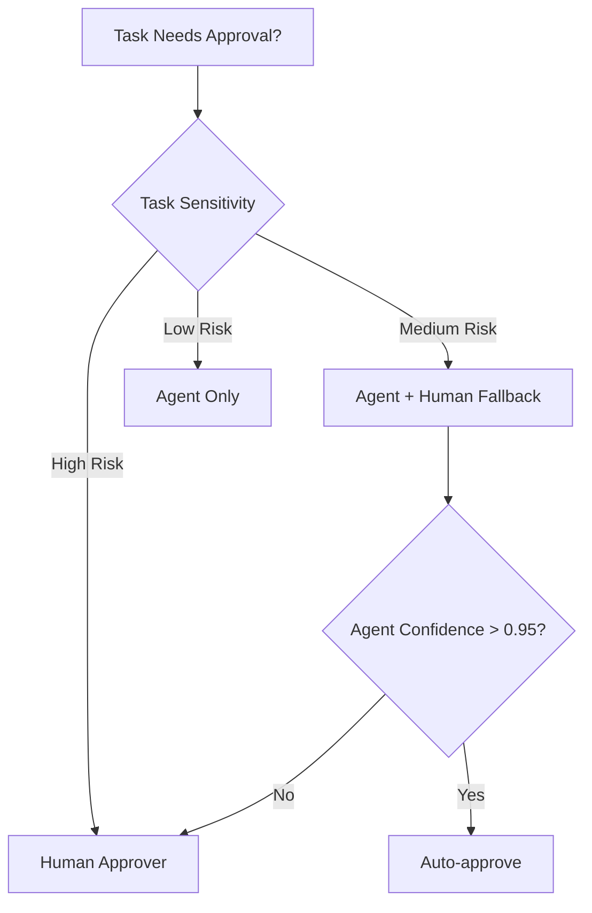
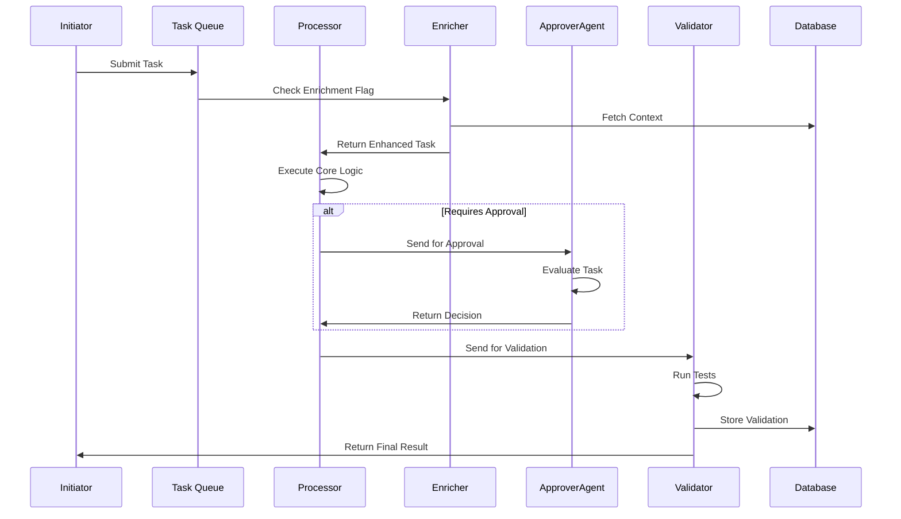

## Enhanced Task Execution System: Agent Approvers, Testability & Enrichment

Let's evolve the system with your requirements:

### 1. Agent-Based Approval System

Replace human approvers with specialized agents when appropriate:

```python
class ApprovalAgent:
    def __init__(self, model="gpt-4-turbo"):
        self.model = model
        self.policy_engine = PolicyEngine()

    def evaluate_task(self, task, proposed_action):
        """Agent decides whether to approve/reject/modify"""
        # Contextual policy check
        if self.policy_engine.violates_policy(proposed_action):
            return "reject", "Policy violation"

        # LLM-based evaluation
        prompt = f"""
        Task: {task['description']}
        Proposed action: {proposed_action}
        Company policies: {self.policy_engine.get_relevant_policies(task)}

        Should this be approved? (approve/reject/modify)
        Reasoning:
        """
        response = llm_invoke(prompt, model=self.model)
        return parse_decision(response)

# Integrated into processing workflow
def process_task(task_id):
    ...
    if requires_approval(result):
        approver = select_approver(task)  # Human or agent based on task sensitivity

        if isinstance(approver, ApprovalAgent):
            decision, feedback = approver.evaluate_task(task, result)
            handle_decision(task_id, decision, feedback)
        else:
            notify_human(task_id)
```

**Approver Selection Logic**:



### 2. Outcome Testability Framework

Ensure verifiable results through automated validation:

```python
class TaskValidator:
    def __init__(self):
        self.validators = {
            "data_processing": DataValidator(),
            "content_generation": FactChecker(),
            "financial_operation": ComplianceChecker()
        }

    def validate(self, task, result):
        validator = self.validators.get(task["type"], DefaultValidator())
        return validator.execute(task, result)

# Example validator using LLM fact-checking
class FactChecker:
    def execute(self, task, content):
        prompt = f"""
        Verify factual accuracy:
        Context: {task['context']}
        Content: {content}

        List any inaccuracies as JSON:
        {{
            "errors": [{{"claim": "...", "issue": "...", "source": "..."}}],
            "valid": bool
        }}
        """
        return llm_invoke(prompt, json_mode=True)

# Integrated into finalization
def finalize_task(task, result):
    validation = validator.validate(task, result)

    if not validation["valid"]:
        handle_validation_failure(task, validation["errors"])
    else:
        # Proceed with completion
        ...
```

**Validation Strategies**:

- **Structural Checks**: Schema validation, format compliance
- **Logical Checks**: Business rule verification
- **Statistical Checks**: Data distribution analysis
- **LLM-based Checks**: Fact verification, consistency analysis
- **Human Spot Checks**: Random sampling for high-risk tasks

### 3. Task Enrichment System

Dynamic context building for complex tasks:

```python
class ContextEnricher:
    def __init__(self):
        self.enrichers = {
            "customer_service": CustomerHistoryEnricher(),
            "research": WebSearchEnricher(),
            "technical": DocumentationEnricher()
        }

    def enrich(self, task):
        """Add task-specific context"""
        base_context = task.get("context", "")

        # Apply type-specific enrichment
        enricher = self.enrichers.get(task["type"], DefaultEnricher())
        additional_context = enricher.gather_context(task)

        # Apply LLM-based contextual compression
        if len(additional_context) > 2000:
            additional_context = compress_context(additional_context)

        return f"{base_context}\n\n## Additional Context:\n{additional_context}"

# AI-powered context compression
def compress_context(text, focus_areas=task["key_elements"]):
    prompt = f"""
    Summarize this text focusing on {focus_areas}:
    {text}

    Keep all critical details related to the focus areas.
    Omit irrelevant information.
    """
    return llm_invoke(prompt)

# Integrated into preprocessing
def preprocess_task(task):
    if task.get("requires_enrichment", False):
        task["context"] = ContextEnricher().enrich(task)
    return task
```

### Enhanced System Workflow



### Key Enhancements

1. **Intelligent Approver Routing**:

   - Sensitivity-based approver selection
   - Agent approval confidence thresholds
   - Policy-first evaluation approach

2. **Multi-Layer Testability**:

   ```python
   class ValidationPipeline:
       def run(self, task, result):
           # Run validations in sequence
           for validator in [IntegrityCheck(), BusinessRuleCheck(), LLMFactCheck()]:
               if not validator.validate(task, result):
                   return False
           return True
   ```

3. **Context-Aware Enrichment**:

   - Dynamic context gathering based on task type
   - Automatic relevance filtering
   - Context compression for LLM efficiency
   - Pre-enrichment cost estimation

4. **Observability Additions**:
   - Approval agent confidence scoring
   - Validation pass/fail rates
   - Enrichment cost/benefit metrics
   - Agent-human handoff tracking

### Technology Upgrades

| Component           | New Tools/Approaches                    |
| ------------------- | --------------------------------------- |
| **Approval Agents** | Fine-tuned LLMs + Rule-based engines    |
| **Validation**      | Great Expectations + Custom LLM prompts |
| **Enrichment**      | Knowledge graphs + Vector databases     |
| **Monitoring**      | LangSmith + Custom metrics dashboard    |

### Security & Governance

1. **Approval Chaining**:
   - High-value tasks require multiple agent approvals
   - Consensus-based decision protocols
2. **Validation Watermarks**:
   - Cryptographic signing of validated outputs
   - Immutable audit trails
3. **Enrichment Guardrails**:
   - Context permission scoping
   - PII redaction during enrichment
   - Cost controls for external data sources

This enhanced system maintains human oversight where needed while maximizing automated efficiency through agent-based approval and robust validation pipelines. The enrichment system ensures tasks have optimal context without unnecessary overhead.
